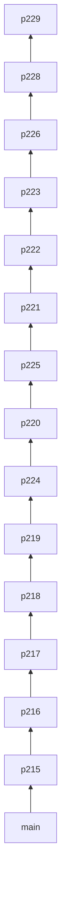

# Audit fix stack (PRs #215–#229)

Linear stack for merging the codebase audit fixes. Each PR targets the **previous branch**, not `main` (except the first).

Merge **bottom to top**. After each merge, GitHub retargets downstream PRs automatically if you use "Merge pull request" (not squash-all-at-once unless you prefer one commit on main).

## Stack diagram



## Merge order

| # | PR | Branch | Base |
|---|-----|--------|------|
| 1 | [#215](https://github.com/ChristianDenniss/volleyProject/pull/215) | `fix/dev-vars-example` | `main` |
| 2 | [#216](https://github.com/ChristianDenniss/volleyProject/pull/216) | `fix/login-redirect` | `fix/dev-vars-example` |
| 3 | [#217](https://github.com/ChristianDenniss/volleyProject/pull/217) | `fix/region-header-admin-only` | `fix/login-redirect` |
| 4 | [#218](https://github.com/ChristianDenniss/volleyProject/pull/218) | `fix/trpc-error-leakage` | `fix/region-header-admin-only` |
| 5 | [#219](https://github.com/ChristianDenniss/volleyProject/pull/219) | `fix/banned-user-session` | `fix/trpc-error-leakage` |
| 6 | [#224](https://github.com/ChristianDenniss/volleyProject/pull/224) | `feat/auth-route-middleware` | `fix/banned-user-session` |
| 7 | [#220](https://github.com/ChristianDenniss/volleyProject/pull/220) | `feat/api-rate-limiting` | `feat/auth-route-middleware` |
| 8 | [#225](https://github.com/ChristianDenniss/volleyProject/pull/225) | `feat/security-headers` | `feat/api-rate-limiting` |
| 9 | [#221](https://github.com/ChristianDenniss/volleyProject/pull/221) | `fix/games-batch-revalidation` | `feat/security-headers` |
| 10 | [#222](https://github.com/ChristianDenniss/volleyProject/pull/222) | `perf/games-create-many-batch` | `fix/games-batch-revalidation` |
| 11 | [#223](https://github.com/ChristianDenniss/volleyProject/pull/223) | `fix/players-create-many-conflicts` | `perf/games-create-many-batch` |
| 12 | [#226](https://github.com/ChristianDenniss/volleyProject/pull/226) | `fix/home-numbers-cache-key` | `fix/players-create-many-conflicts` |
| 13 | [#228](https://github.com/ChristianDenniss/volleyProject/pull/228) | `fix/vector-graph-types` | `fix/home-numbers-cache-key` |
| 14 | [#229](https://github.com/ChristianDenniss/volleyProject/pull/229) | `test/sheet-import-worker` | `fix/vector-graph-types` |

**Stack tip:** `audit-stack` and `test/sheet-import-worker` point at the same commit (full stack).

## How to merge

1. Open [#215](https://github.com/ChristianDenniss/volleyProject/pull/215) → merge to `main`.
2. Open [#216](https://github.com/ChristianDenniss/volleyProject/pull/216) → merge (base updates to `main` after #215 lands; rebase if GitHub asks).
3. Repeat through [#229](https://github.com/ChristianDenniss/volleyProject/pull/229).

Or merge only the tip ([#229](https://github.com/ChristianDenniss/volleyProject/pull/229)) into `main` once the whole stack is approved — that brings in all commits at once.

## Re-stack after changes

If a lower PR changes and upper branches need replaying:

```powershell
powershell -ExecutionPolicy Bypass -File tooling/stack-audit-prs.ps1
```

Resolve conflicts at `fix/banned-user-session` (`server/trpc/context.ts`) and `feat/security-headers` (`server/worker.ts`) if they reappear.
